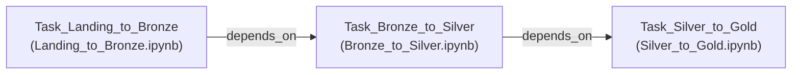

# CineData Analytics — Engenharia de Dados & Lakehouse Databricks

Este repositório contém a implementação completa do pipeline de dados da plataforma **CineData Analytics**, estruturado segundo a arquitetura Medalhão (**Landing $\rightarrow$ Bronze $\rightarrow$ Silver $\rightarrow$ Gold**) no ecossistema Apache Spark / Databricks.

O projeto contempla a ingestão de bases heterogêneas, higienização e conformação de dados com contratos estritos, modelagem dimensional (*Star Schema*) para consumo analítico (BI), engenharia de contexto para aplicações de Inteligência Artificial Generativa (*RAG*) e orquestração automatizada via Databricks Workflows.

---

## 1. Arquitetura do Lakehouse

```mermaid
flowchart TD
    subgraph Landing["1. Camada Landing (Raw Ingestion)"]
        L1["Arquivos CSV/JSON Brutos"]
        L2["Cotações PTAX (API Banco Central)"]
    end

    subgraph Bronze["2. Camada Bronze (Raw Ingestion / Append-Only)"]
        B1["bronze.tb_movies_info"]
        B2["bronze.tb_movies_financials"]
        B3["bronze.tb_movies_metrics"]
        B4["bronze.tb_movies_reviews"]
        B5["bronze.tb_credits_and_tags"]
        B6["bronze.tb_cotacao_dolar"]
    end

    subgraph Silver["3. Camada Silver (Conformed & Cleansed)"]
        S1["silver.tb_info_filmes"]
        S2["silver.tb_financeiro_filmes"]
        S3["silver.tb_metricas_engajamento"]
        S4["silver.tb_avaliacoes_usuarios"]
        S5["silver.tb_generos"]
        S6["silver.tb_pessoas_empresas"]
        S7["silver.tb_cotacao_dolar"]
    end

    subgraph Gold["4. Camada Gold (Data Marts & Analytics)"]
        D_MOV["gold.dim_movies"]
        D_GEN["gold.dim_genres"]
        D_PEO["gold.dim_people"]
        D_COM["gold.dim_companies"]
        D_REV["gold.dim_reviews"]
        
        B_GEN["gold.bridge_movie_genre"]
        B_PEO["gold.bridge_movie_person"]
        B_COM["gold.bridge_movie_company"]
        
        F_PERF["gold.fact_movies_performance"]
        G_AI["gold.gold_genai_movies_context"]
    end

    Landing --> Bronze
    Bronze --> Silver
    Silver --> Gold
```



---

## 2. Estrutura do Repositório e Entregas

```text
.
├── notebooks/
│   ├── 00_Setup_Ambiente.ipynb     # Infraestrutura compartilhada: Spark, paths, utilitários e DQ
│   ├── Landing_to_Bronze.ipynb     # Ingestão de CSVs e API PTAX → camada Bronze (Parquet)
│   ├── Bronze_to_Silver.ipynb      # Conformação, tipagem segura e regras de negócio → Silver
│   └── Silver_to_Gold.ipynb        # Modelagem Star Schema, Data Mart GenAI e Analytics → Gold
├── run_pipeline.sh                 # Script de execução sequencial do pipeline completo (local)
├── job.yaml                        # Manifesto de orquestração do Databricks Workflow
├── README.md                       # Documentação executiva, técnica e dicionário de dados
├── pyproject.toml                  # Dependências e gerenciamento de ambiente Python (uv)
├── data/                           # Armazenamento em formato Parquet do Data Lakehouse
│   ├── landing/                    # Arquivos CSV brutos de entrada
│   ├── bronze/
│   ├── silver/
│   └── gold/
└── docs/                           # Documentações complementares de engenharia e decisões
    ├── INSTRUCOES_DEPLOY_DATABRICKS.md
    ├── DECISOES_ARQUITETURAIS.md
    ├── PLANO_EXECUCAO_SILVER_TO_GOLD.md
    ├── OBSERVACOES_DADOS.md
    ├── schema.dbml
    ├── image.png
    └── vibeschema-diagram.png
```

---

## 3. Modelagem Dimensional da Camada Gold (*Star Schema*)

A modelagem dimensional foi projetada seguindo as melhores práticas de Ralph Kimball para evitar duplicidade de métricas na tabela Fato e possibilitar consultas analíticas de alta performance via Business Intelligence.

```mermaid
erDiagram
    dim_movies ||--|| fact_movies_performance : "1 : 1"
    dim_movies ||--o{ dim_reviews : "1 : 1 (Resumido)"
    dim_movies ||--o{ bridge_movie_genre : "1 : N"
    dim_genres ||--o{ bridge_movie_genre : "1 : N"
    dim_movies ||--o{ bridge_movie_person : "1 : N"
    dim_people ||--o{ bridge_movie_person : "1 : N"
    dim_movies ||--o{ bridge_movie_company : "1 : N"
    dim_companies ||--o{ bridge_movie_company : "1 : N"

    dim_movies {
        bigint sk_movie_id PK
        string id_filme
        string titulo
        date data_lancamento
        int ano_lancamento
        int duracao_minutos
        string idioma_original
        string status_filme
        string sinopse
    }

    fact_movies_performance {
        bigint sk_movie_id PK_FK
        decimal orcamento_usd
        decimal receita_usd
        decimal lucro_usd
        decimal orcamento_brl
        decimal receita_brl
        decimal lucro_brl
        double popularidade
        double nota_media_tmdb
        int qtd_votos_tmdb
        double nota_media_imdb
        int qtd_votos_imdb
    }

    dim_genres {
        bigint sk_genre_id PK
        string nome_genero
    }

    dim_people {
        bigint sk_person_id PK
        string nome_pessoa
        string tipo_pessoa
    }

    dim_companies {
        bigint sk_company_id PK
        string nome_produtora
    }

    dim_reviews {
        bigint sk_review_id PK
        bigint sk_movie_id FK
        int qtd_avaliacoes_usuarios
        double nota_media_usuarios
    }

    bridge_movie_genre {
        bigint sk_movie_id FK
        bigint sk_genre_id FK
    }

    bridge_movie_person {
        bigint sk_movie_id FK
        bigint sk_person_id FK
    }

    bridge_movie_company {
        bigint sk_movie_id FK
        bigint sk_company_id FK
    }
```

### 3.1 Dicionário de Dados das Tabelas Gold

| Tabela | Colunas Principais | Tipo | Grão / Descrição |
| :--- | :--- | :--- | :--- |
| `gold.dim_movies` | `sk_movie_id` (PK), `id_filme`, `titulo`, `data_lancamento`, `ano_lancamento`, `duracao_minutos`, `idioma_original`, `status_filme`, `sinopse` | Dimensão | 1 registro único por filme oficial do catálogo (97.879 registros). |
| `gold.dim_genres` | `sk_genre_id` (PK), `nome_genero` | Dimensão | 1 registro por gênero oficial deduplicado (19 gêneros canônicos). |
| `gold.dim_people` | `sk_person_id` (PK), `nome_pessoa`, `tipo_pessoa` | Dimensão | Catálogo de participantes físicos (`Ator`, `Diretor`, `Roteirista`) (419.176 registros). |
| `gold.dim_companies` | `sk_company_id` (PK), `nome_produtora` | Dimensão | Catálogo de produtoras e estúdios cinematográficos (45.348 empresas). |
| `gold.dim_reviews` | `sk_review_id` (PK), `sk_movie_id` (FK), `qtd_avaliacoes_usuarios`, `nota_media_usuarios` | Dimensão Agregada | Métricas consolidadas de avaliações de usuários por filme (14.544 filmes avaliados). |
| `gold.bridge_movie_genre` | `sk_movie_id` (FK), `sk_genre_id` (FK) | Tabela-Ponte | Relação N:N entre filmes e gêneros cinematográficos (140.426 relacionamentos). |
| `gold.bridge_movie_person` | `sk_movie_id` (FK), `sk_person_id` (FK) | Tabela-Ponte | Relação N:N entre filmes e pessoas físicas envolvidas (760.511 relacionamentos). |
| `gold.bridge_movie_company` | `sk_movie_id` (FK), `sk_company_id` (FK) | Tabela-Ponte | Relação N:N entre filmes e produtoras responsáveis (118.476 relacionamentos). |
| `gold.fact_movies_performance` | `sk_movie_id` (PK/FK), `orcamento_usd`, `receita_usd`, `lucro_usd`, `orcamento_brl`, `receita_brl`, `lucro_brl`, `popularidade`, `nota_media_tmdb`, `qtd_votos_tmdb`, `nota_media_imdb`, `qtd_votos_imdb` | Fato | Métricas financeiras e engajamento em grão atômico 1:1 com `dim_movies` (97.879 registros). |
| `gold.gold_genai_movies_context` | `movie_id`, `title`, `llm_context_document` | Data Mart RAG | Texto corrido contextualizado para indexação em banco vetorial (97.879 documentos). |

---

## 4. Data Mart Generative AI (`gold.gold_genai_movies_context`)

Para atender aos requisitos de alimentação de sistemas de busca vetorial (*Vector Search / RAG*), foi construída a tabela `gold.gold_genai_movies_context`.

### 4.1 Engenharia de Prompt e Template
A coluna `llm_context_document` unifica as dimensões e fatos em prosa fluida:
> `"O filme [TÍTULO], lançado no ano de [ANO], faturou [RECEITA] e teve um custo de [ORÇAMENTO]. Estrelado por [ATORES PRINCIPAIS] e dirigido por [DIRETOR], o filme possui a seguinte sinopse: [OVERVIEW]."`

### 4.2 Arquitetura de Proteção contra Nulos (*NULL-Safety*)
Operações convencionais de concatenação (`concat`, operador `||`) retornam `NULL` caso qualquer operando seja nulo. Para garantir que 100% dos filmes estejam presentes na base vetorial sem exclusões silenciosas, foi estabelecida a seguinte estratégia de fallback:
* **Título**: `coalesce(trim(titulo), "Título não informado")`
* **Ano**: `when(ano_lancamento.isNotNull(), ano_lancamento).otherwise("ano não informado")`
* **Receita / Orçamento**: `when(valor.isNotNull() & (valor > 0), "US$ " + format_number(valor, 2)).otherwise("valor não informado")`
* **Elenco Principal / Diretores**: Agregação dos primeiros participantes com fallbacks `"elenco não informado"` e `"diretor não informado"`.
* **Sinopse**: `coalesce(trim(sinopse), "Sinopse não disponível.")`

---

## 5. Resolução do Desafio de Analytics

As 6 perguntas analíticas foram implementadas e validadas sobre o Star Schema da camada Gold:

### Pergunta 1: Qual é a receita total (em R$) somada de todos os filmes da base?
* **Resultado**: **R$ 2.457.064.214.284,54** (~ R$ 2,45 trilhões de Reais).
* **Consulta Spark**:
  ```python
  dataframe_fact_movies_performance.select(
      spark_sum(col("receita_brl")).cast("decimal(18,2)").alias("receita_total_brl")
  ).show(truncate=False)
  ```

---

### Pergunta 2: Quais são os 5 filmes com maior popularidade? Mostre título e valor de popularidade.
* **Resultado**:
  | Posição | Título do Filme | Popularidade |
  | :---: | :--- | :---: |
  | 1º | Star Wars: The Force Awakens | 93.184 |
  | 2º | Avatar | 89.255 |
  | 3º | Inception | 88.136 |
  | 4º | Avengers: Age of Ultron | 86.812 |
  | 5º | Deadpool | 85.290 |

---

### Pergunta 3: Quantos filmes cada gênero possui? Liste do maior para o menor volume.
* **Resultado**:
  | Gênero Canônico | Volume de Filmes | Gênero Canônico | Volume de Filmes |
  | :--- | :---: | :--- | :---: |
  | **Drama** | 44.629 | **Mystery** | 4.887 |
  | **Comedy** | 30.158 | **Fantasy** | 3.593 |
  | **Documentary** | 15.545 | **Family** | 3.543 |
  | **Thriller** | 11.512 | **War** | 2.502 |
  | **Action** | 9.843 | **Science Fiction**| 2.476 |
  | **Romance** | 8.847 | **History** | 1.838 |
  | **Horror** | 7.915 | **TV Movie** | 1.579 |
  | **Animation** | 7.189 | **Western** | 1.488 |
  | **Music** | 5.257 | | |
  | **Crime** | 5.093 | | |

---

### Pergunta 4: Para os 10 filmes de maior receita, mostre título, receita (em US$ e R$) e a posição de cada um no ranking (`RANK()`).
* **Resultado**:
  | Posição (`RANK`) | Título do Filme | Receita (US$) | Receita (R$) |
  | :---: | :--- | :---: | :---: |
  | 1 | Avatar | US$ 2.923.706.026,00 | R$ 15.083.407.388,13 |
  | 2 | Avengers: Endgame | US$ 2.799.439.100,00 | R$ 14.442.306.316,90 |
  | 3 | Avatar: The Way of Water | US$ 2.320.250.281,00 | R$ 11.970.171.200,04 |
  | 4 | Titanic | US$ 2.264.162.353,00 | R$ 11.680.813.579,13 |
  | 5 | Star Wars: The Force Awakens | US$ 2.071.310.218,00 | R$ 10.685.890.414,66 |
  | 6 | Avengers: Infinity War | US$ 2.052.415.039,00 | R$ 10.588.409.035,80 |
  | 7 | Spider-Man: No Way Home | US$ 1.921.847.111,00 | R$ 9.914.809.245,65 |
  | 8 | Jurassic World | US$ 1.671.537.444,00 | R$ 8.623.461.673,59 |
  | 9 | The Lion King | US$ 1.663.075.401,00 | R$ 8.579.805.993,76 |
  | 10 | The Avengers | US$ 1.520.538.532,00 | R$ 7.844.458.286,59 |

---

### Pergunta 5: Qual ator teve a maior quantidade de participações nos filmes lançados nos últimos 2 anos?
* **Horizonte Temporal**: Recorte relativo considerando a data de lançamento realizada mais recente na base (`max(data_lancamento)` válida).
* **Resultado**: **Eric Roberts** com **24 participações** em filmes lançados no período de 2 anos.

---

### Pergunta 6: Qual a produtora de filmes teve o maior Lucro nos últimos 5 anos?
* **Horizonte Temporal**: Janela de 5 anos retroativos a partir da data de lançamento mais recente na base.
* **Top 5 Produtoras por Lucro**:
  | Posição | Nome da Produtora | Lucro Total Acumulado (US$) |
  | :---: | :--- | :---: |
  | **1º** | **Universal Pictures** | **US$ 5.772.329.679,00** |
  | 2º | Marvel Studios | US$ 4.953.462.823,00 |
  | 3º | Columbia Pictures | US$ 3.662.050.755,00 |
  | 4º | Pascal Pictures | US$ 2.701.952.454,00 |
  | 5º | Illumination | US$ 2.431.353.473,00 |

---

## 6. Orquestração e Automação no Databricks (`job.yaml`)

O fluxo de processamento de ponta a ponta é automatizado pelo manifesto `job.yaml`, garantindo dependências explícitas e agendamento diário:



### Configurações de Destaque no `job.yaml`:
* **Multi-Task Workflow**: Execução determinística em pipeline linear.
* **Job Cluster Compartilhado**: Otimização de custos provisionando um único cluster efêmero para as três tarefas.
* **Agendamento Quartz Cron**: Execução diária às 06:00 (Fuso horário `America/Sao_Paulo`).
* **Resiliência**: Política de 2 tentativas de repetição (*retries*) com intervalo de 60 segundos em caso de timeout.

---

## 7. Como Reproduzir e Executar Localmente

### Pré-requisitos

| Requisito | Versão mínima | Verificação |
| :--- | :--- | :--- |
| Python | 3.14+ | `python --version` |
| Java JDK | 17+ | `java -version` |
| `uv` | qualquer | `uv --version` |

> **JAVA_HOME**: O PySpark exige Java. Verifique com `echo $JAVA_HOME`. Se vazio, instale via `sudo apt install openjdk-17-jdk` e exporte `export JAVA_HOME=/usr/lib/jvm/java-17-openjdk-amd64`.

---

### Setup Inicial (uma única vez)

```bash
# 1. Instalar todas as dependências (pipeline + ferramentas de execução local)
uv sync --extra dev

# 2. Registrar o kernel Jupyter no seu ambiente de usuário
uv run python -m ipykernel install --user --name visagio --display-name "visagio (3.14)"

# 3. Colocar os CSVs brutos na Landing Zone
#    Os 5 arquivos abaixo devem estar em data/landing/ antes de rodar o pipeline:
#      - movies_info_TMDB_IMDB.csv
#      - movies_financials_IMDB_TMDB.csv
#      - movies_metrics_IMDB_TMDB.csv
#      - credits_and_tags_IMDB_TMDB.csv
#      - movies_reviews.csv
```

---

### Ordem de Execução dos Notebooks

```text
00_Setup_Ambiente.ipynb          ← executado automaticamente via %run pelos demais
        ↓
Landing_to_Bronze.ipynb          ← Passo 1: ingere CSVs + API PTAX → Bronze (Parquet)
        ↓
Bronze_to_Silver.ipynb           ← Passo 2: tipagem, higienização, forward fill → Silver
        ↓
Silver_to_Gold.ipynb             ← Passo 3: Star Schema, Data Mart GenAI, Analytics → Gold
```

---

### Opção A — Jupyter Lab (Interativo)

```bash
# Abrir o Jupyter Lab na pasta notebooks/
uv run jupyter lab notebooks/

# No navegador, abra e execute em sequência:
# 1. Landing_to_Bronze.ipynb  → Kernel: "visagio (3.14)" → Run All
# 2. Bronze_to_Silver.ipynb   → Kernel: "visagio (3.14)" → Run All
# 3. Silver_to_Gold.ipynb     → Kernel: "visagio (3.14)" → Run All
```

> **Sobre as variáveis "não definidas" no editor**: Ao abrir um notebook que usa `%run ./00_Setup_Ambiente.ipynb`, ferramentas como VS Code ou JupyterLab marcam as funções e variáveis do setup como "não encontradas" antes da primeira execução. Isso é comportamento esperado do language server — os símbolos só existem no namespace do kernel após o `%run` ser executado. Desaparecem completamente após **Run All** (ou ao executar a primeira célula).

---

### Opção B — CLI / Headless (sem interface gráfica)

```bash
# Executar o pipeline completo sequencialmente
bash run_pipeline.sh

# Ou individualmente, notebook a notebook:
uv run jupyter nbconvert \
    --to notebook --execute \
    --ExecutePreprocessor.kernel_name=visagio \
    --ExecutePreprocessor.timeout=3600 \
    --output notebooks/Landing_to_Bronze.ipynb \
    notebooks/Landing_to_Bronze.ipynb

uv run jupyter nbconvert \
    --to notebook --execute \
    --ExecutePreprocessor.kernel_name=visagio \
    --ExecutePreprocessor.timeout=3600 \
    --output notebooks/Bronze_to_Silver.ipynb \
    notebooks/Bronze_to_Silver.ipynb

uv run jupyter nbconvert \
    --to notebook --execute \
    --ExecutePreprocessor.kernel_name=visagio \
    --ExecutePreprocessor.timeout=3600 \
    --output notebooks/Silver_to_Gold.ipynb \
    notebooks/Silver_to_Gold.ipynb
```

---

### Opção C — VS Code

1. Abra a pasta `notebooks/` no VS Code.
2. Abra qualquer notebook (`.ipynb`).
3. No canto superior direito, clique em **"Select Kernel"** → **"Jupyter Kernel"** → selecione **`visagio (3.14)`**.
4. Execute com **"Run All"** respeitando a ordem acima.

