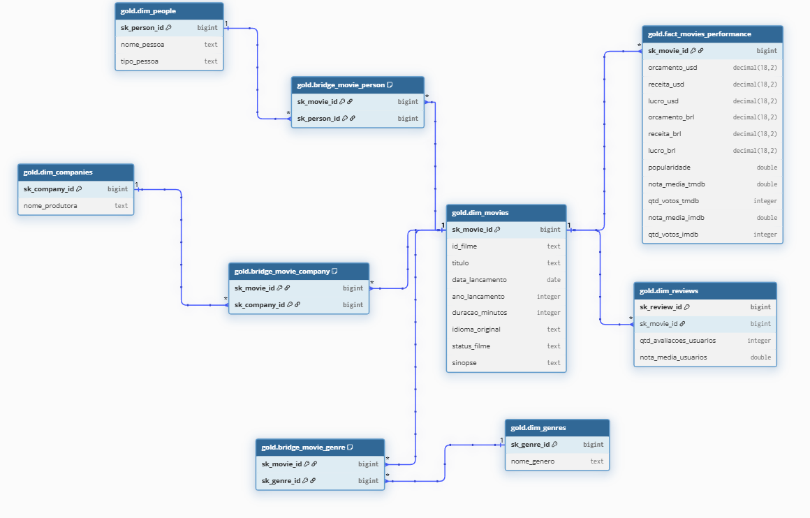
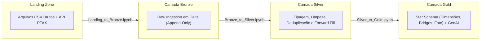
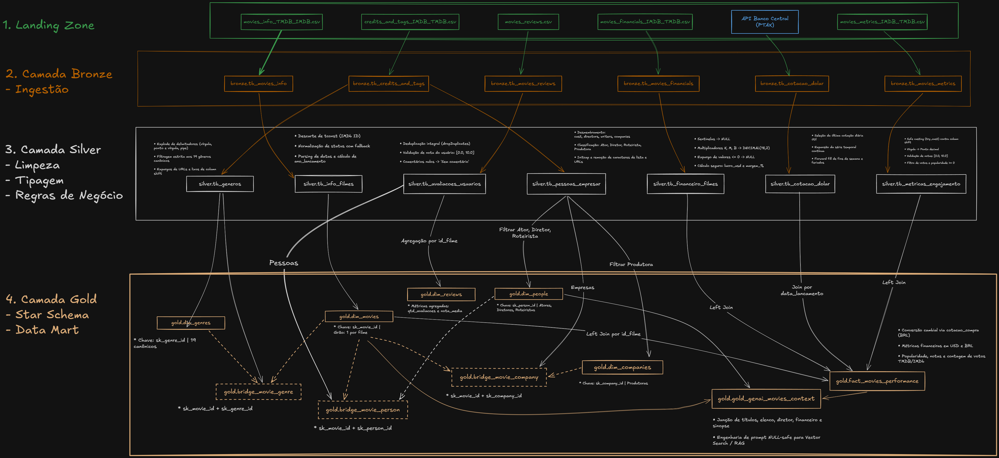

# CineData Analytics — Engenharia de Dados & Lakehouse

<p align="left">
  
  
  
  
  
  
</p>

Pipeline de dados medalhão (**Landing $\rightarrow$ Bronze $\rightarrow$ Silver $\rightarrow$ Gold**) construído com PySpark no Databricks Serverless, cobrindo ingestão, limpeza/conformação, modelagem dimensional (*Star Schema*) e preparação de Data Mart para IA Generativa (RAG).

---

## 1. Respostas das Perguntas de Negócio (Analytics)

Todas as análises foram executadas sobre a camada **Gold** (`gold.fact_movies_performance` e dimensões relacionadas):

### Pergunta 1: Qual é a receita total (em R$) somada de todos os filmes da base?
* **Resultado**: **R$ 837.771.586.093,24** (~ R$ 837,77 bilhões).
* **Taxa de Câmbio Utilizada**: **R$ 5,1569** por US$ 1,00 (taxa PTAX de Compra do Banco Central de 18/09/2026, obtida via API Olinda).
* **Consulta Spark**:
  ```python
  fact_movies_performance.select(
      spark_sum(col("receita_brl")).cast("decimal(18,2)").alias("receita_total_brl")
  ).show(truncate=False)
  ```

---

### Pergunta 2: Quais são os 5 filmes com maior popularidade?
| Posição | Título do Filme | Popularidade |
| :---: | :--- | :---: |
| 1º | blue beetle | 2994.357 |
| 2º | Gran Turismo | 2680.593 |
| 3º | The Nun II | 1692.778 |
| 4º | Meg 2: The Trench | 1567.273 |
| 5º | retribution | 1547.220 |

> **Nota (Tratamento de *Column Shift*)**: No arquivo bruto de origem (`movies_metrics_IMDB_TMDB.csv`), linhas com descompasso estrutural empurraram anos inteiros de lançamento (`2020`, `2019`, `2018`) para a coluna de popularidade. A camada Silver implementou a neutralização desse deslocamento via `try_cast` e detecção de caracteres textuais nos campos de notas/votos, expurgando falsos positivos e garantindo a integridade analítica das métricas.

---

### Pergunta 3: Quantos filmes cada gênero possui? (Maior para menor)
| Rank | Gênero Canônico | Qtd. Filmes |
| :---: | :--- | :---: |
| **1º** | Drama | 32.286 |
| **2º** | Documentary | 18.996 |
| **3º** | Comedy | 18.624 |
| **4º** | Thriller | 10.274 |
| **5º** | Horror | 9.729 |
| **6º** | Romance | 7.639 |
| **7º** | Action | 6.049 |
| **8º** | Crime | 4.747 |
| **9º** | Animation | 4.469 |
| **10º** | TV Movie | 4.079 |
| **11º** | Science Fiction | 3.769 |
| **12º** | Family | 3.722 |
| **13º** | Mystery | 3.317 |
| **14º** | Fantasy | 3.278 |
| **15º** | Adventure | 2.870 |
| **16º** | Music | 2.792 |
| **17º** | History | 2.416 |
| **18º** | War | 960 |
| **19º** | Western | 410 |

---

### Pergunta 4: Top 10 filmes de maior receita com `RANK()`
| Rank | Título do Filme | Receita (US$) | Receita (R$) |
| :---: | :--- | :---: | :---: |
| 1 | Avengers: Endgame | US$ 2.800.000.000,00 | R$ 14.439.320.000,00 |
| 2 | Avatar: The Way of Water | US$ 2.320.250.281,00 | R$ 11.965.298.674,09 |
| 3 | AVENGERS: INFINITY WAR | US$ 2.052.415.039,00 | R$ 10.584.099.114,62 |
| 4 | spider-man: no way home | US$ 1.921.847.111,00 | R$ 9.910.773.366,72 |
| 5 | The Lion King | US$ 1.663.075.401,00 | R$ 8.576.313.535,42 |
| 6 | Top Gun: Maverick | US$ 1.488.732.821,00 | R$ 7.677.246.284,61 |
| 7 | Barbie | US$ 1.428.545.028,00 | R$ 7.366.863.854,89 |
| 8 | The Super Mario Bros. Movie | US$ 1.355.725.263,00 | R$ 6.991.339.608,76 |
| 9 | Black Panther | US$ 1.349.926.083,00 | R$ 6.961.433.817,42 |
| 10 | Star Wars: The Last Jedi | US$ 1.332.698.830,00 | R$ 6.872.594.596,43 |

> **Nota Cambial**: A conversão da receita para Reais (R$) foi realizada utilizando a cotação PTAX de Compra do Banco Central de **R$ 5,1569** por dólar (referência de 18/09/2026), padronizada no pipeline Silver.

---

### Pergunta 5: Qual ator teve mais participações nos filmes lançados nos últimos 2 anos?
* **Resultado**: **Kevin Hart** lidera com **64 participações**, seguido por Melissa Ponzio (59), Josh Hartnett (59), John Travolta (59) e John Cena (59).

---

### Pergunta 6: Qual produtora teve o maior Lucro nos últimos 5 anos?
| Posição | Produtora | Lucro Acumulado (US$) |
| :---: | :--- | :---: |
| **1º** | **Universal Pictures** | **US$ 5.772.329.679,00** |
| 2º | Marvel Studios | US$ 4.953.462.823,00 |
| 3º | Columbia Pictures | US$ 3.662.050.755,00 |
| 4º | Pascal Pictures | US$ 2.701.952.454,00 |
| 5º | Illumination | US$ 2.431.353.473,00 |

---

## 2. Modelagem Dimensional (Camada Gold)

A modelagem segue a arquitetura dimensional em estrela (*Star Schema*), com tabelas-ponte para relacionamentos N:N, garantindo o grão atômico 1:1 na tabela fato de performance.



* **Fato**: `gold.fact_movies_performance` (grão: 1 registro por filme, contendo orçamentos, receitas, lucro em USD/BRL e métricas de audiência TMDB/IMDb).
* **Dimensões**: `dim_movies`, `dim_genres`, `dim_people`, `dim_companies`, `dim_reviews`.
* **Bridges**: `bridge_movie_genre`, `bridge_movie_person`, `bridge_movie_company`.
* **Data Mart GenAI**: `gold_genai_movies_context` (documento textual enriquecido e protegido contra nulos para busca semântica / RAG).

---

## 3. Arquitetura e Fluxo do Pipeline

O pipeline processa os dados de ponta a ponta através de notebooks modulares:



### Arquivos de Ingestão (Landing Zone)
1. **`movies_info_TMDB_IMDB.csv`**: Metadados gerais (título, sinopse, lançamento, duração, idioma, status).
2. **`movies_financials_IMDB_TMDB.csv`**: Dados de bilheteria e orçamento (US$).
3. **`movies_metrics_IMDB_TMDB.csv`**: Notas e métricas de popularidade/votos TMDB e IMDb.
4. **`credits_and_tags_IMDB_TMDB.csv`**: Elenco, diretores, roteiristas, gêneros e produtoras.
5. **`movies_reviews.csv`**: Avaliações textuais e notas de usuários.
6. **API Banco Central (PTAX)**: Cotação diária do dólar comercial (USD $\rightarrow$ BRL) via API Olinda do BACEN. Para a conversão monetária das métricas financeiras (orçamento, receita e lucro), utilizou-se a taxa PTAX de Compra mais recente da série histórica disponível (**R$ 5,1569**, de 18/09/2026), com propagação contínua (*Forward Fill*) para fins de semana e feriados.

---

## 4. Execução e Orquestração

O fluxo foi orquestrado no **Databricks Workflows** utilizando **Serverless Compute**, executado com sucesso ponta a ponta:


### Scripts Operacionais (`scripts/`)
* **Deploy no Databricks**: `./scripts/deploy_databricks.sh` (sincroniza notebooks no workspace e configura o job via `job.yaml`).
* **Disparo e Monitoramento**: `./scripts/run_job.sh` (dispara a run via Databricks CLI e monitora logs em tempo real).

---

## 5. Linhagem e Regras de Transformação Detalhadas por Origem

O diagrama a seguir detalha a jornada de cada arquivo individual de entrada, as regras de conformação aplicadas na camada **Silver** e as junções dimensionais consolidadas na camada **Gold**:


