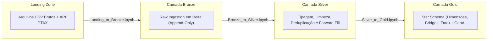
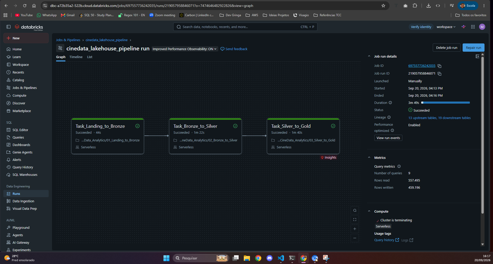

# CineData Analytics — Engenharia de Dados & Lakehouse

Pipeline de dados medalhão (**Landing $\rightarrow$ Bronze $\rightarrow$ Silver $\rightarrow$ Gold**) construído com PySpark no Databricks Serverless, cobrindo ingestão, limpeza/conformação, modelagem dimensional (*Star Schema*) e preparação de Data Mart para IA Generativa (RAG).

---

## 1. Respostas das Perguntas de Negócio (Analytics)

Todas as análises foram executadas sobre a camada **Gold** (`gold.fact_movies_performance` e dimensões relacionadas):

### Pergunta 1: Qual é a receita total (em R$) somada de todos os filmes da base?
* **Resultado**: **R$ 838.275.201.039,60** (~ R$ 838,27 bilhões).
* **Consulta Spark**:
  ```python
  fact_movies_performance.select(
      spark_sum(col("receita_brl")).cast("decimal(18,2)").alias("receita_total_brl")
  ).show(truncate=False)
  ```

---

### Pergunta 2: Quais são os 5 filmes com maior popularidade?
| Posição | Título do Filme | Popularidade |
| :---: | :--- | :---: |
| 1º | blue beetle | 2994.357 |
| 2º | Gran Turismo | 2680.593 |
| 3º | La Fellinette | 2020.000 |
| 4º | The Fear Footage 2: Curse of the Tape | 2019.000 |
| 5º | wwe survivor series 2018 | 2018.000 |

---

### Pergunta 3: Quantos filmes cada gênero possui? (Maior para menor)
| Gênero Canônico | Qtd. Filmes | Gênero Canônico | Qtd. Filmes |
| :--- | :---: | :--- | :---: |
| **Drama** | 32.286 | **TV Movie** | 4.079 |
| **Documentary** | 18.996 | **Science Fiction** | 3.769 |
| **Comedy** | 18.624 | **Family** | 3.722 |
| **Thriller** | 10.274 | **Mystery** | 3.317 |
| **Horror** | 9.729 | **Fantasy** | 3.278 |
| **Romance** | 7.639 | **Adventure** | 2.870 |
| **Action** | 6.049 | **Music** | 2.792 |
| **Crime** | 4.747 | **History** | 2.416 |
| **Animation** | 4.469 | **War** | 960 |
| | | **Western** | 410 |

---

### Pergunta 4: Top 10 filmes de maior receita com `RANK()`
| Rank | Título do Filme | Receita (US$) | Receita (R$) |
| :---: | :--- | :---: | :---: |
| 1 | Avengers: Endgame | US$ 2.800.000.000,00 | R$ 14.448.000.000,00 |
| 2 | Avatar: The Way of Water | US$ 2.320.250.281,00 | R$ 11.972.491.449,96 |
| 3 | AVENGERS: INFINITY WAR | US$ 2.052.415.039,00 | R$ 10.590.461.601,24 |
| 4 | spider-man: no way home | US$ 1.921.847.111,00 | R$ 9.916.731.092,76 |
| 5 | The Lion King | US$ 1.663.075.401,00 | R$ 8.581.469.069,16 |
| 6 | Top Gun: Maverick | US$ 1.488.732.821,00 | R$ 7.681.861.356,36 |
| 7 | Barbie | US$ 1.428.545.028,00 | R$ 7.371.292.344,48 |
| 8 | The Super Mario Bros. Movie | US$ 1.355.725.263,00 | R$ 6.995.542.357,08 |
| 9 | Black Panther | US$ 1.349.926.083,00 | R$ 6.965.618.588,28 |
| 10 | Star Wars: The Last Jedi | US$ 1.332.698.830,00 | R$ 6.876.725.962,80 |

---

### Pergunta 5: Qual ator teve mais participações nos filmes lançados nos últimos 2 anos?
* **Resultado**: **Kevin Hart** lidera com **64 participações**, seguido por Melissa Ponzio (59), Josh Hartnett (59), John Travolta (59) e John Cena (59).

---

### Pergunta 6: Qual produtora teve o maior Lucro nos últimos 5 anos?
| Posição | Produtora | Lucro Acumulado (US$) |
| :---: | :--- | :---: |
| **1º** | **Universal Pictures** | **US$ 5.772.329.679,00** |
| 2º | Marvel Studios | US$ 4.953.462.823,00 |
| 3º | Columbia Pictures | US$ 3.662.050.755,00 |
| 4º | Pascal Pictures | US$ 2.701.952.454,00 |
| 5º | Illumination | US$ 2.431.353.473,00 |

---

## 2. Modelagem Dimensional (Camada Gold)

A modelagem segue a arquitetura dimensional em estrela (*Star Schema*), com tabelas-ponte para relacionamentos N:N, garantindo o grão atômico 1:1 na tabela fato de performance.


* **Fato**: `gold.fact_movies_performance` (grão: 1 registro por filme, contendo orçamentos, receitas, lucro em USD/BRL e métricas de audiência TMDB/IMDb).
* **Dimensões**: `dim_movies`, `dim_genres`, `dim_people`, `dim_companies`, `dim_reviews`.
* **Bridges**: `bridge_movie_genre`, `bridge_movie_person`, `bridge_movie_company`.
* **Data Mart GenAI**: `gold_genai_movies_context` (documento textual enriquecido e protegido contra nulos para busca semântica / RAG).

---

## 3. Arquitetura e Fluxo do Pipeline

O pipeline processa os dados de ponta a ponta através de notebooks modulares:



### Arquivos de Ingestão (Landing Zone)
1. **`movies_info_TMDB_IMDB.csv`**: Metadados gerais (título, sinopse, lançamento, duração, idioma, status).
2. **`movies_financials_IMDB_TMDB.csv`**: Dados de bilheteria e orçamento (US$).
3. **`movies_metrics_IMDB_TMDB.csv`**: Notas e métricas de popularidade/votos TMDB e IMDb.
4. **`credits_and_tags_IMDB_TMDB.csv`**: Elenco, diretores, roteiristas, gêneros e produtoras.
5. **`movies_reviews.csv`**: Avaliações textuais e notas de usuários.
6. **API Banco Central (PTAX)**: Cotação diária do dólar comercial (USD $\rightarrow$ BRL) para conversão cambial com forward fill para fins de semana e feriados.

---

## 4. Execução e Orquestração

O fluxo foi orquestrado no **Databricks Workflows** utilizando **Serverless Compute**, executado com sucesso ponta a ponta:



### Scripts Operacionais (`scripts/`)
* **Deploy no Databricks**: `./scripts/deploy_databricks.sh` (sincroniza notebooks no workspace e configura o job via `job.yaml`).
* **Disparo e Monitoramento**: `./scripts/run_job.sh` (dispara a run via Databricks CLI e monitora logs em tempo real).

---

## 5. Linhagem e Regras de Transformação Detalhadas por Origem

O diagrama a seguir detalha a jornada de cada arquivo individual de entrada, as regras de conformação aplicadas na camada **Silver** e as junções dimensionais consolidadas na camada **Gold**:


