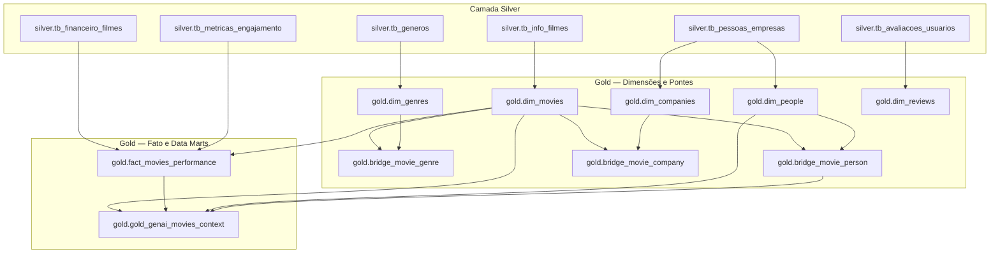
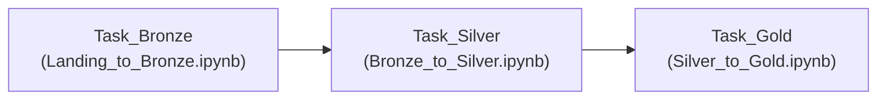

# Plano de Execução e Arquitetura: Pipeline Silver para Gold (Data Lakehouse)
## CineData Analytics

Este documento estabelece o plano completo, detalhado e normativo para o desenvolvimento do pipeline da camada **Silver para Gold** (`Silver_to_Gold.ipynb`), estruturação dos Data Marts dimensionais (*Star Schema*), tabela analítica de contexto para Inteligência Artificial Generativa (*RAG*), resolução do desafio analítico e orquestração de Jobs no Databricks.

---

## 1. Visão Geral e Objetivos do Pipeline Gold

O pipeline da camada Gold representa a consolidação das regras de negócio, modelagem dimensional e preparação para consumo analítico (Business Intelligence) e produtos de inteligência artificial.

### 1.1 Objetivos Centrais
1. **Modelagem Dimensional (Star Schema)**:
   - Desacoplamento de entidades em tabelas Dimensão e Fato.
   - Geração de Chaves Substitutas (*Surrogate Keys - SK*) do tipo `BIGINT` para isolamento das chaves de negócio naturais.
   - Resolução de relacionamentos *N:N* (Muitos-para-Muitos) via tabelas-ponte (*Bridge Tables*), impedindo a explosão de grão na tabela Fato.
2. **Engenharia de Contexto para GenAI / RAG (`gold_genai_movies_context`)**:
   - Unificação de dados descritivos, financeiros e artísticos em prosa textual fluida.
   - Eliminação de propagação de nulos (*NULL-safety*) garantindo que nenhum documento seja descartado por ausência de dados parciais.
3. **Resolução das Perguntas Analíticas de Negócio**:
   - Implementação de consultas em PySpark demonstrando o valor analítico da modelagem dimensional.
4. **Conformidade Estrita com Padrões de Código**:
   - Aderência integral às diretrizes de código limpo, sem variáveis de uma letra, sem números mágicos, sem comentários de fluxo procedural e com funções semânticas puras.

---

## 2. Matriz de Linhagem e Contratos de Dados (Silver $\rightarrow$ Gold)

---

## 3. Especificação Técnica das Tabelas da Camada Gold

### 3.1 `gold.dim_movies` (Dimensão Principal de Filmes)
* **Objetivo**: Catálogo descritivo e metadados oficiais de cada filme.
* **Origem**: `silver.tb_info_filmes`
* **Grão**: 1 linha por filme (`id_filme`).
* **Estratégia de SK**: Geração determinística de `sk_movie_id` via `row_number().over(Window.orderBy(col("id_filme")))`.
* **Esquema de Destino**:
  | Coluna | Tipo Spark | Descrição / Regra de Negócio |
  | :--- | :--- | :--- |
  | `sk_movie_id` | `BIGINT` | Chave substituta primária da dimensão filme. |
  | `id_filme` | `STRING` | Chave natural de origem convertida para texto. |
  | `titulo` | `STRING` | Título comercial padronizado do filme. |
  | `data_lancamento` | `DATE` | Data de lançamento oficial. |
  | `ano_lancamento` | `INT` | Ano de lançamento extraído da data. |
  | `duracao_minutos` | `INT` | Duração em minutos. |
  | `idioma_original` | `STRING` | Código do idioma original. |
  | `status_filme` | `STRING` | Situação cadastral traduzida (ex: 'Lançado'). |
  | `sinopse` | `STRING` | Descrição e sinopse do filme. |

---

### 3.2 `gold.dim_genres` (Dimensão de Gêneros)
* **Objetivo**: Catálogo único, padronizado e deduplicado de todos os gêneros cinematográficos.
* **Origem**: `silver.tb_generos`
* **Grão**: 1 linha por gênero único (`nome_genero`).
* **Estratégia de SK**: `row_number().over(Window.orderBy(col("nome_genero")))` gerando `sk_genre_id`.
* **Esquema de Destino**:
  | Coluna | Tipo Spark | Descrição |
  | :--- | :--- | :--- |
  | `sk_genre_id` | `BIGINT` | Chave substituta primária da dimensão gênero. |
  | `nome_genero` | `STRING` | Nome padronizado do gênero (canônico). |

---

### 3.3 `gold.dim_people` (Dimensão de Pessoas Físicas)
* **Objetivo**: Consolidar todas as pessoas físicas envolvidas na obra cinematográfica (`Ator`, `Diretor`, `Roteirista`).
* **Origem**: `silver.tb_pessoas_empresas` filtrando `tipo_entidade != 'Produtora'`.
* **Grão**: 1 linha por pessoa e tipo de atuação `(nome_pessoa, tipo_pessoa)`.
* **Estratégia de SK**: `row_number().over(Window.orderBy(col("nome_pessoa"), col("tipo_pessoa")))` gerando `sk_person_id`.
* **Esquema de Destino**:
  | Coluna | Tipo Spark | Descrição / Regra |
  | :--- | :--- | :--- |
  | `sk_person_id` | `BIGINT` | Chave substituta primária da pessoa. |
  | `nome_pessoa` | `STRING` | Nome limpo e capitalizado da pessoa física. |
  | `tipo_pessoa` | `STRING` | Papel desempenhado (`'Ator'`, `'Diretor'`, `'Roteirista'`). |

---

### 3.4 `gold.dim_companies` (Dimensão de Produtoras / Estúdios)
* **Objetivo**: Catálogo deduplicado de empresas e produtoras responsáveis pelas obras.
* **Origem**: `silver.tb_pessoas_empresas` filtrando `tipo_entidade == 'Produtora'`.
* **Grão**: 1 linha por produtora única `(nome_produtora)`.
* **Estratégia de SK**: `row_number().over(Window.orderBy(col("nome_produtora")))` gerando `sk_company_id`.
* **Esquema de Destino**:
  | Coluna | Tipo Spark | Descrição |
  | :--- | :--- | :--- |
  | `sk_company_id` | `BIGINT` | Chave substituta primária da empresa/produtora. |
  | `nome_produtora` | `STRING` | Nome limpo da produtora/estúdio. |

---

### 3.5 `gold.dim_reviews` (Dimensão Agregada de Avaliações de Usuários)
* **Objetivo**: Consolidar as avaliações individuais geradas pelos usuários, transformando-as em métricas resumidas por filme.
* **Origem**: `silver.tb_avaliacoes_usuarios` combinada com `gold.dim_movies`.
* **Grão**: 1 linha por filme avaliado (`sk_movie_id`).
* **Regra de Agregação**:
  - `qtd_avaliacoes_usuarios = count(id_filme).cast("int")`
  - `nota_media_usuarios = round(avg(nota_usuario), 2).cast("double")`
* **Estratégia de SK**: `row_number().over(Window.orderBy(col("sk_movie_id")))` gerando `sk_review_id`.
* **Esquema de Destino**:
  | Coluna | Tipo Spark | Descrição |
  | :--- | :--- | :--- |
  | `sk_review_id` | `BIGINT` | Chave substituta primária da agregação de avaliações. |
  | `sk_movie_id` | `BIGINT` | Chave estrangeira apontando para `gold.dim_movies`. |
  | `qtd_avaliacoes_usuarios` | `INT` | Volume total de avaliações recebidas pelo filme. |
  | `nota_media_usuarios` | `DOUBLE` | Nota média calculada e arredondada em 2 casas decimais. |

---

### 3.6 Tabelas-Ponte (*Bridge Tables*)

As tabelas-ponte são mandatórias para resolver os relacionamentos N:N sem duplicar linhas na tabela Fato.

#### A. `gold.bridge_movie_genre`
* **Origem**: Join entre `silver.tb_generos`, `gold.dim_movies` (`on id_filme`) e `gold.dim_genres` (`on nome_genero`).
* **Colunas**:
  - `sk_movie_id` (`BIGINT`) - FK
  - `sk_genre_id` (`BIGINT`) - FK

#### B. `gold.bridge_movie_person`
* **Origem**: Join entre `silver.tb_pessoas_empresas` (onde `tipo_entidade IN ('Ator', 'Diretor', 'Roteirista')`), `gold.dim_movies` e `gold.dim_people`.
* **Colunas**:
  - `sk_movie_id` (`BIGINT`) - FK
  - `sk_person_id` (`BIGINT`) - FK

#### C. `gold.bridge_movie_company`
* **Origem**: Join entre `silver.tb_pessoas_empresas` (onde `tipo_entidade == 'Produtora'`), `gold.dim_movies` e `gold.dim_companies`.
* **Colunas**:
  - `sk_movie_id` (`BIGINT`) - FK
  - `sk_company_id` (`BIGINT`) - FK

---

### 3.7 `gold.fact_movies_performance` (Tabela Fato Central)
* **Objetivo**: Centralizar todas as métricas financeiras e de engajamento do filme em um grão atômico estrito.
* **Origem**: Join 1:1 entre `gold.dim_movies` (base), `silver.tb_financeiro_filmes` e `silver.tb_metricas_engajamento` através da chave natural `id_filme`.
* **Grão**: 1 linha por filme lançado (`sk_movie_id`).
* **Esquema de Destino**:
  | Coluna | Tipo Spark | Origem / Regra |
  | :--- | :--- | :--- |
  | `sk_movie_id` | `BIGINT` | Chave estrangeira (e primária da fato) referenciando `dim_movies`. |
  | `orcamento_usd` | `DECIMAL(18,2)` | Orçamento do filme em Dólares. |
  | `receita_usd` | `DECIMAL(18,2)` | Receita bruta de bilheteria em Dólares. |
  | `lucro_usd` | `DECIMAL(18,2)` | Lucro líquido calculado em Dólares. |
  | `orcamento_brl` | `DECIMAL(18,2)` | Orçamento convertido em Reais (taxa cambial). |
  | `receita_brl` | `DECIMAL(18,2)` | Receita convertida em Reais (taxa cambial). |
  | `lucro_brl` | `DECIMAL(18,2)` | Lucro líquido convertido em Reais. |
  | `popularidade` | `DOUBLE` | Índice de popularidade (TMDB). |
  | `nota_media_tmdb` | `DOUBLE` | Média de notas TMDB (escala 0 a 10). |
  | `qtd_votos_tmdb` | `INT` | Volume de votos registrados no TMDB. |
  | `nota_media_imdb` | `DOUBLE` | Média de notas IMDb (escala 0 a 10). |
  | `qtd_votos_imdb` | `INT` | Volume de votos registrados no IMDb. |

---

## 4. Entrega 2 — Data Mart Generative AI (`gold.gold_genai_movies_context`)

### 4.1 Requisitos de Negócio e Engenharia de Prompt
A tabela de contexto deve consolidar a descrição semântica dos filmes para indexação em banco vetorial (*Vector Search / RAG*).

* **Template Oficial**:
  > `"O filme [TÍTULO], lançado no ano de [ANO], faturou [RECEITA] e teve um custo de [ORÇAMENTO]. Estrelado por [ATORES PRINCIPAIS] e dirigido por [DIRETOR], o filme possui a seguinte sinopse: [OVERVIEW]."`

### 4.2 Tratamento Anti-Nulos (*NULL-Safety Architecture*)
Funções de concatenação convencionais geram `NULL` se qualquer operando for nulo. Para evitar que filmes com informações incompletas sejam silenciosamente excluídos, implementa-se uma camada de fallback declarativa:

1. **`[TÍTULO]`**: `coalesce(trim(titulo), lit("Título não informado"))`
2. **`[ANO]`**: `when(ano_lancamento.isNotNull(), ano_lancamento.cast("string")).otherwise(lit("ano não informado"))`
3. **`[RECEITA]`**: `when(receita_usd.isNotNull() & (receita_usd > 0), concat(lit("US$ "), format_number(receita_usd, 2))).otherwise(lit("valor não informado"))`
4. **`[ORÇAMENTO]`**: `when(orcamento_usd.isNotNull() & (orcamento_usd > 0), concat(lit("US$ "), format_number(orcamento_usd, 2))).otherwise(lit("valor não informado"))`
5. **`[ATORES PRINCIPAIS]`**: Agregação de atores via `collect_set` limitados aos principais participantes, unidos com `concat_ws(", ", ...)` e fallback `"elenco não informado"`.
6. **`[DIRETOR]`**: Agregação de diretores unidos com `concat_ws(", ", ...)` e fallback `"diretor não informado"`.
7. **`[OVERVIEW]`**: `coalesce(trim(sinopse), lit("Sinopse não disponível."))`

* **Esquema de Destino**:
  | Coluna | Tipo Spark | Descrição |
  | :--- | :--- | :--- |
  | `movie_id` | `STRING` | Chave natural do filme para rastreabilidade. |
  | `title` | `STRING` | Título legível do filme. |
  | `llm_context_document` | `STRING` | Frase textual contínua e semântica sanitizada. |

---

## 5. Resolução das Consultas do Desafio de Analytics

Todas as perguntas analíticas serão implementadas com PySpark e consultas SQL complementares utilizando o Star Schema construído:

| # | Pergunta de Negócio | Lógica Técnica de Resolução |
| :---: | :--- | :--- |
| **Q1** | Qual é a receita total (em R$) somada de todos os filmes da base? | `sum(col("receita_brl"))` sobre `gold.fact_movies_performance`. |
| **Q2** | Quais são os 5 filmes com maior popularidade? Mostre título e valor. | Join entre `gold.fact_movies_performance` e `gold.dim_movies`, ordenado por `popularidade.desc()`, `limit(5)`. |
| **Q3** | Quantos filmes cada gênero possui? Liste do maior para o menor. | Join entre `gold.bridge_movie_genre` e `gold.dim_genres`, agrupando por `nome_genero` com `count(sk_movie_id).desc()`. |
| **Q4** | Para os 10 filmes de maior receita, mostre título, receita (US$ e R$) e `RANK()`. | `Window.orderBy(col("receita_usd").desc())` aplicando `rank()` sobre a Fato e Dimensão de filmes. |
| **Q5** | Qual ator teve a maior quantidade de participações em filmes lançados nos últimos 2 anos? | Recorte temporal relativo: `data_lancamento >= (data_maxima_base - interval 2 years)`. Join entre `dim_movies`, `bridge_movie_person` e `dim_people` filtrando `tipo_pessoa == 'Ator'`, agrupando por `nome_pessoa`. |
| **Q6** | Qual a produtora de filmes teve o maior Lucro nos últimos 5 anos? | Recorte temporal relativo: `data_lancamento >= (data_maxima_base - interval 5 years)`. Join entre `fact_movies_performance`, `dim_movies`, `bridge_movie_company` e `dim_companies`, somando `lucro_usd` agrupado por `nome_produtora`. |

*Nota sobre a janela temporal*: Conforme o contrato do PDF, a data limite superior considerada é a **data de lançamento realizada mais recente na base** (`max(data_lancamento)` onde `data_lancamento <= current_date()`).

---

## 6. Estrutura e Sequência de Células do Notebook `Silver_to_Gold.ipynb`

O notebook seguirá uma organização modular com comentários intencionais estritamente voltados às regras de negócio:

1. **Célula 1 [Markdown]**: Título e documentação do pipeline Silver $\rightarrow$ Gold.
2. **Célula 2 [Code]**: Setup da SparkSession, caminhos de I/O (`SILVER_DIRECTORY`, `GOLD_DIRECTORY`) e funções utilitárias compartilhadas (`write_dataframe_with_timestamp`).
3. **Célula 3 [Markdown & Code]**: Construção e persistência de `gold.dim_movies`.
4. **Célula 4 [Markdown & Code]**: Construção e persistência de `gold.dim_genres`.
5. **Célula 5 [Markdown & Code]**: Construção e persistência de `gold.dim_people`.
6. **Célula 6 [Markdown & Code]**: Construção e persistência de `gold.dim_companies`.
7. **Célula 7 [Markdown & Code]**: Construção e persistência de `gold.dim_reviews`.
8. **Célula 8 [Markdown & Code]**: Construção e persistência das tabelas-ponte (`bridge_movie_genre`, `bridge_movie_person`, `bridge_movie_company`).
9. **Célula 9 [Markdown & Code]**: Construção e persistência de `gold.fact_movies_performance`.
10. **Célula 10 [Markdown & Code]**: Construção e persistência de `gold.gold_genai_movies_context`.
11. **Célula 11 [Markdown & Code]**: Execução e exibição das Consultas de Analytics (Perguntas 1 a 6).

---

## 7. Orquestração e Exportação do Databricks Workflow (`job.yaml`)

### 7.1 Arquitetura do Workflow
O Job do Databricks será composto por três tarefas em cascata linear:

### 7.2 Especificação do Arquivo `job.yaml`
O arquivo de manifesto da automação conterá:
* Configuração de cluster único compartilhado (*job cluster* otimizado).
* Definição explícita de `depends_on` para garantir ordem determinística de execução.
* Agendamento cron configurado para simular a rotina produtiva de atualização dos dados.
* Políticas de retry e timeout para resiliência operacional.

---

## 8. Critérios de Aceite e Checklist de Validação

- [ ] Todas as 9 tabelas da camada Gold geradas e gravadas no formato Parquet com partição e tipagem corretas.
- [ ] Grão único estrito na tabela `gold.fact_movies_performance` sem duplicatas geradas por joins.
- [ ] Chaves substitutas (`BIGINT`) íntegras entre Fato, Dimensões e Bridges.
- [ ] Tabela `gold_genai_movies_context` com 100% dos registros preenchidos sem retorno acidental de `NULL` na frase de contexto.
- [ ] 6 perguntas analíticas respondidas corretamente e exibidas de forma clara.
- [ ] Código 100% aderente ao padrão de qualidade (sem variáveis de uma letra, sem números mágicos, sem comentários de fluxo e modular).
- [ ] Arquivo `job.yaml` validado e estruturado na raiz do repositório.
